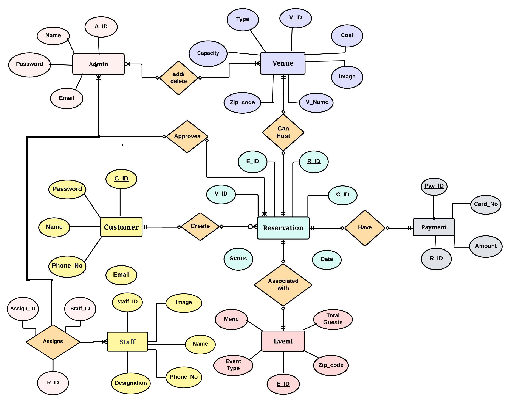
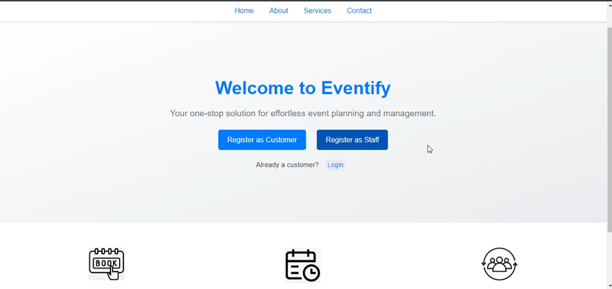
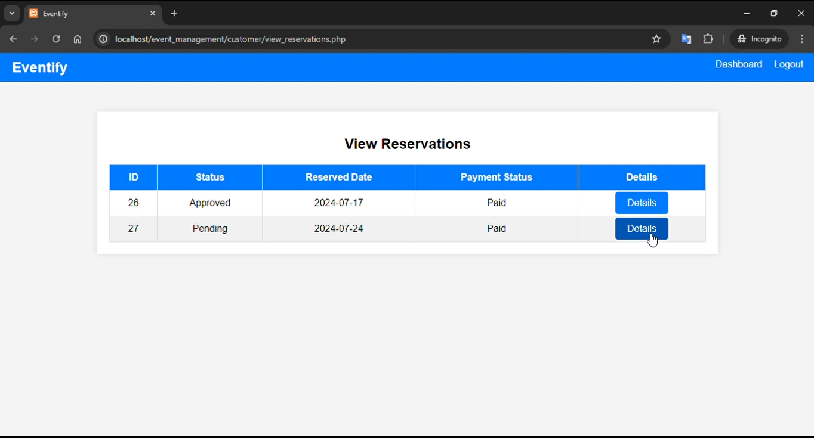

# 🎉 Eventify — Event Management System

A full-stack web application for end-to-end event planning and management. Customers can browse venues, create reservations, and make payments. Admins manage venues and approve bookings. Staff members are assigned to reservations by admins.

---

## 📋 Table of Contents

- [Features](#features)
- [Tech Stack](#tech-stack)
- [System Architecture](#system-architecture)
- [Database Schema](#database-schema)
- [Getting Started](#getting-started)
- [Project Structure](#project-structure)
- [User Roles](#user-roles)
- [Screenshots](#screenshots)

---

## ✨ Features

### Customer
- Register and log in securely
- Browse venues filtered by zip code
- Create reservations with custom event type, menu, guest count, and date
- View reservation status (Pending / Approved)
- Make payments with automatic invoice calculation
- View detailed reservation summary and billing

### Admin
- Secure admin login portal
- Add, edit, and delete venues (name, type, capacity, cost, zip code, image)
- Review and approve customer reservations
- Assign staff members to reservations

### Staff
- Register as a staff member (name, designation, phone, image)
- Get assigned to reservations by the admin

### General
- Real-time reservation status updates
- Automatic payment calculation based on menu tier and venue cost
- Responsive UI across all pages

---

## 🛠️ Tech Stack

| Layer      | Technology          |
|------------|---------------------|
| Frontend   | HTML5, CSS3         |
| Backend    | PHP (procedural)    |
| Database   | MySQL               |
| Server     | Apache (via XAMPP)  |
| Dev Tools  | VS Code, SSMS       |

---

## 🗄️ System Architecture

The system is built around **6 core entities** connected via a relational database:

**ER Diagram:**



---

## 🗃️ Database Schema

### Tables

**`admin`** — `A_ID`, `Name`, `Email`, `Password`

**`customer`** — `C_ID`, `Name`, `Email`, `Password`, `Phone_No`

**`venue`** — `V_ID`, `V_Name`, `Type`, `Capacity`, `Cost`, `Zip_code`, `Image`

**`event`** — `E_ID`, `Event_Type`, `Menu`, `Total_Guests`, `Zip_code`

**`reservation`** — `R_ID`, `C_ID`, `V_ID`, `E_ID`, `Date`, `Status`

**`payment`** — `Pay_ID`, `R_ID`, `Card_No`, `Amount`

**`staff`** — `Staff_ID`, `Name`, `Designation`, `Phone_No`, `Image`

**`assigns`** — `Assign_ID`, `Staff_ID`, `R_ID`

### Menu Pricing

| Menu Tier   | Price per Guest |
|-------------|-----------------|
| Simple      | $320            |
| Delux       | $550            |
| Super Delux | $760            |
| VIP         | $1,000          |

> **Total Amount** = (Guests × Menu Price) + Venue Cost

---

## 🚀 Getting Started

### Prerequisites

- [XAMPP](https://www.apachefriends.org/) (Apache + MySQL + PHP)
- A modern web browser

### Installation

1. **Clone the repository**
   ```bash
   git clone https://github.com/YOUR_USERNAME/event-management-system.git
   ```

2. **Move to your XAMPP htdocs folder**
   ```bash
   # Windows
   move event-management-system C:\xampp\htdocs\event_management

   # macOS / Linux
   mv event-management-system /opt/lampp/htdocs/event_management
   ```

3. **Configure the database**
   ```bash
   cp config.example.php config.php
   ```
   Then open `config.php` and fill in your MySQL credentials:
   ```php
   define('DB_USERNAME', 'root');
   define('DB_PASSWORD', '');       // your MySQL password
   define('DB_NAME', 'event_management');
   ```

4. **Import the database**
   - Open **phpMyAdmin** → `http://localhost/phpmyadmin`
   - Create a new database named `event_management`
   - Import `event_management.sql` from the repo root

5. **Start XAMPP** — enable Apache and MySQL

6. **Open the app**
   ```
   http://localhost/event_management/
   ```

---

## 📁 Project Structure

```
event_management/
├── index.php                   # Landing page (Eventify homepage)
├── config.php                  # DB credentials (git-ignored)
├── config.example.php          # Safe template for config
├── customer_navbar.php         # Shared navbar component
├── homepage_styles.css
├── login.css
│
├── admin/                      # Admin portal
│   ├── login.php
│   ├── dashboard.php
│   ├── manage_venues.php
│   ├── add_venue.php
│   ├── edit_venue.php
│   ├── approve_reservations.php
│   └── assign_staff.php
│
├── customer/                   # Customer portal
│   ├── login.php
│   ├── register.php
│   ├── dashboard.php
│   ├── create_reservation.php
│   ├── view_reservations.php
│   ├── reservation_details.php
│   ├── make_payment.php
│   ├── billing.php
│   └── complete_payment.php
│
├── staff/                      # Staff registration
│   └── staff_register.php
│
├── includes/                   # Shared PHP components
│   ├── db.php
│   ├── header.php
│   └── footer.php
│
├── public/                     # Public-facing pages
│   ├── list_venues.php
│   └── list_events.php
│
├── images/                     # Homepage images
└── css/                        # Global styles
```

---

## 👥 User Roles

| Role     | Access URL                          | Default Credentials (dev only)   |
|----------|-------------------------------------|----------------------------------|
| Admin    | `/admin/login.php`                  | Set up via DB directly           |
| Customer | `/customer/login.php`               | Register at `/customer/register.php` |
| Staff    | Registered at `/staff/staff_register.php` | Assigned by admin           |

---

## 📸 Screenshots

| Page | Description |
|------|-------------|
|  | **Homepage** — Eventify landing page |
|  | **Customer Portal** — Reservation management |

---

## 🔒 Security Notes

- `config.php` is listed in `.gitignore` and should **never** be committed
- Session-based authentication is used for both admin and customer portals
- All passwords should be hashed with `password_hash()` before storing in production

---

## 📄 License

This project was developed as an academic project. Feel free to use it as a reference or starting point.
